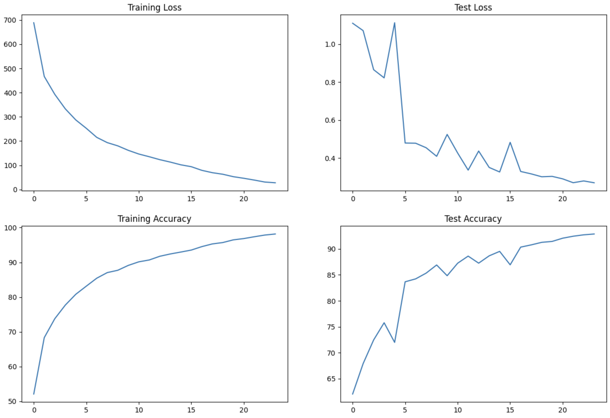

# Convolutional Neural Network For Cifar10 Dataset

## Usage
This repo has a Convolutional Neural Network, That is designed for training the Model over Cifar10 dataset.

### model.py
You will find the model definations, Training and Testing methods inside the custom_resnet.py file.
Model architecture resembles the resnet architectures with 2 skip connections.

#### Summary
Below is the summary of the model.

----------------------------------------------------------------
        Layer (type)               Output Shape         Param #

================================================================

            Conv2d-1           [-1, 64, 32, 32]           1,728
       BatchNorm2d-2           [-1, 64, 32, 32]             128
              ReLU-3           [-1, 64, 32, 32]               0
            Conv2d-4          [-1, 128, 32, 32]          73,728
         MaxPool2d-5          [-1, 128, 16, 16]               0
       BatchNorm2d-6          [-1, 128, 16, 16]             256
              ReLU-7          [-1, 128, 16, 16]               0
            Conv2d-8          [-1, 128, 16, 16]         147,456
       BatchNorm2d-9          [-1, 128, 16, 16]             256
             ReLU-10          [-1, 128, 16, 16]               0
           Conv2d-11          [-1, 128, 16, 16]         147,456
      BatchNorm2d-12          [-1, 128, 16, 16]             256
             ReLU-13          [-1, 128, 16, 16]               0
           Conv2d-14          [-1, 256, 14, 14]         294,912
        MaxPool2d-15            [-1, 256, 7, 7]               0
      BatchNorm2d-16            [-1, 256, 7, 7]             512
             ReLU-17            [-1, 256, 7, 7]               0
           Conv2d-18            [-1, 512, 7, 7]       1,179,648
        MaxPool2d-19            [-1, 512, 3, 3]               0
      BatchNorm2d-20            [-1, 512, 3, 3]           1,024
             ReLU-21            [-1, 512, 3, 3]               0
           Conv2d-22            [-1, 512, 3, 3]       2,359,296
      BatchNorm2d-23            [-1, 512, 3, 3]           1,024
             ReLU-24            [-1, 512, 3, 3]               0
           Conv2d-25            [-1, 512, 3, 3]       2,359,296
      BatchNorm2d-26            [-1, 512, 3, 3]           1,024
             ReLU-27            [-1, 512, 3, 3]               0
        MaxPool2d-28            [-1, 512, 1, 1]               0
           Linear-29                   [-1, 10]           5,120
================================================================

Total params: 6,573,120

Trainable params: 6,573,120

Non-trainable params: 0

----------------------------------------------------------------

Input size (MB): 0.01

Forward/backward pass size (MB): 5.93

Params size (MB): 25.07

Estimated Total Size (MB): 31.02

----------------------------------------------------------------     

***

### S10.ipynb

S10.ipynb is the notebook where the model training is executed by importing all the dependencies required, from loading and transfroming data till training and measuring model performance.

One cycle policy is used to identify the best learning rate under few epochs. Implementation of one cycle policy is in the notebook.

***
## Model Performance
Model performance for Cifar10 Model based on the model architecture mentioned above in summary are as follows:

Batch normalization is used as a normalization technique.
Model is trained over 24 epochs, with Adam as optimizer and CrossEntropyLoss as loss function.

Train Accuracy : 98.16

Test Accuracy : 92.87

## Graphs of Losses and accuracy of the Cifar10 model with Batch Normalization:

